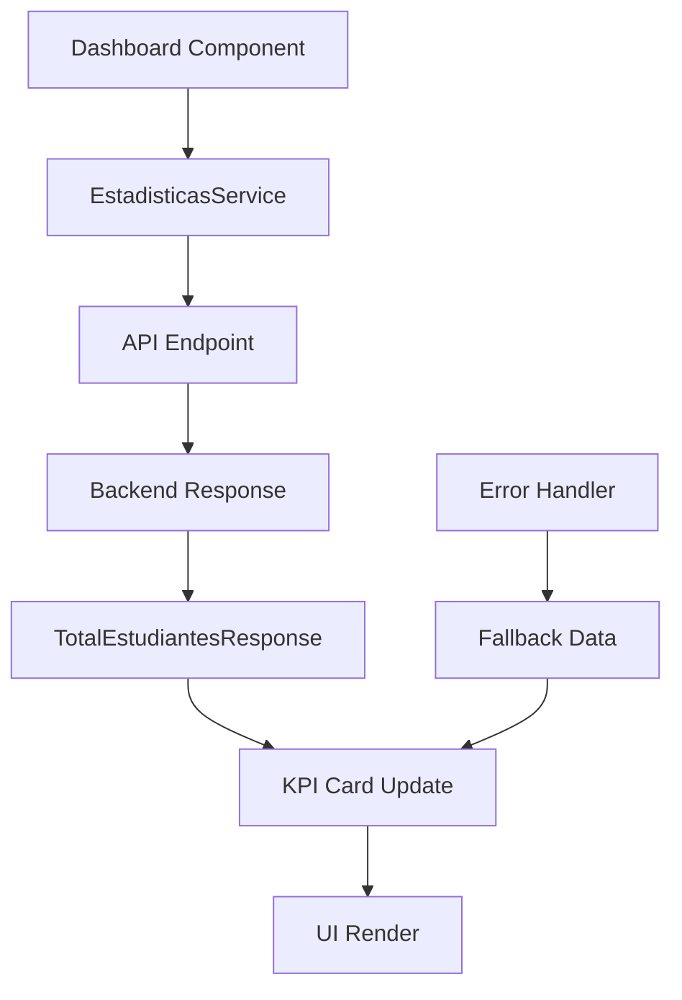

# 📊 Implementación del Endpoint de Estudiantes - Frontend

## 🎯 Resumen de la Implementación

Se ha implementado exitosamente la integración del endpoint `GET /api/estadisticas/total-estudiantes` en el sistema de gestión curricular. La implementación incluye:

### ✅ Componentes Implementados

1. **Modelo de Datos** (`src/app/core/models/estadisticas.model.ts`)
   - Interfaz `TotalEstudiantesResponse` para la respuesta del endpoint

2. **Servicio de Estadísticas** (`src/app/core/services/estadisticas.service.ts`)
   - Método `getTotalEstudiantes()` que consume el endpoint

3. **Endpoints** (`src/app/core/utils/api-endpoints.ts`)
   - URL del endpoint agregada a `MODULO_ESTADISTICO.TOTAL_ESTUDIANTES`

4. **Dashboards Actualizados**
   - Dashboard de Funcionario (`src/app/pages/funcionario/modulo-estadistico/`)
   - Dashboard de Coordinador (`src/app/pages/coordinador/modulo-estadistico/`)

5. **Componente Reutilizable** (`src/app/shared/components/estudiantes-kpi/`)
   - Componente independiente para mostrar el KPI de estudiantes

## 🔧 Uso del Endpoint

### Método del Servicio

```typescript
// Obtener total de estudiantes
this.estadisticasService.getTotalEstudiantes().subscribe({
  next: (response) => {
    console.log('Total de estudiantes:', response.totalEstudiantes);
    console.log('Fecha de consulta:', response.fechaConsulta);
    console.log('Descripción:', response.descripcion);
  },
  error: (error) => {
    console.error('Error al obtener estudiantes:', error);
  }
});
```

### Estructura de la Respuesta

```typescript
interface TotalEstudiantesResponse {
  totalEstudiantes: number;        // Ej: 115
  fechaConsulta: string;           // Ej: "2024-01-15T10:30:00.000Z"
  descripcion: string;             // Ej: "Total de estudiantes registrados en el sistema"
}
```

## 🎨 Características Visuales

### Tarjeta KPI de Estudiantes

- **Colores**: Gradiente azul cian (#17a2b8 → #138496)
- **Animaciones**: Efecto shimmer en la parte superior
- **Icono**: Material Design "people" con emoji 👥
- **Estados**: Loading con animación de shimmer
- **Responsive**: Adaptable a diferentes tamaños de pantalla

### Estilos CSS Aplicados

```css
.kpi-info {
  border-left-color: #17a2b8;
  position: relative;
  overflow: hidden;
}

.kpi-info::before {
  content: '';
  position: absolute;
  top: 0;
  left: 0;
  right: 0;
  height: 3px;
  background: linear-gradient(90deg, #17a2b8, #138496, #20c997);
  animation: shimmer 2s infinite;
}
```

## 🚀 Integración en Dashboards

### Dashboard de Funcionario

El endpoint se integra automáticamente en el dashboard estadístico del funcionario:

1. **Carga Automática**: Se ejecuta al cargar el dashboard
2. **Actualización en Tiempo Real**: Se actualiza cuando se refrescan los datos
3. **Manejo de Errores**: Fallback a datos de prueba si hay error
4. **Estado de Carga**: Indicador visual durante la consulta

### Dashboard de Coordinador

Misma funcionalidad que el dashboard de funcionario, adaptada para el rol de coordinador.

## 📱 Componente Reutilizable

### Uso del Componente EstudiantesKpi

```html
<!-- En cualquier template -->
<app-estudiantes-kpi></app-estudiantes-kpi>
```

### Características del Componente

- **Standalone**: No requiere módulos adicionales
- **Auto-actualización**: Botón de refresh integrado
- **Manejo de Estados**: Loading, error y éxito
- **Responsive**: Se adapta al contenedor padre
- **Accesible**: Tooltips y estados de carga

## 🔄 Flujo de Datos



## 🛡️ Manejo de Errores

### Estrategias Implementadas

1. **Fallback a Datos de Prueba**: Si el endpoint falla, usa datos mock
2. **Mensajes de Error**: Notificaciones al usuario via MatSnackBar
3. **Estados de Carga**: Indicadores visuales durante las consultas
4. **Reintento**: Botón para reintentar la consulta

### Código de Manejo de Errores

```typescript
private cargarTotalEstudiantes(): void {
  this.loadingEstudiantes = true;
  
  const subscription = this.estadisticasService.getTotalEstudiantes()
    .subscribe({
      next: (response) => {
        this.totalEstudiantes = response.totalEstudiantes;
        this.loadingEstudiantes = false;
      },
      error: (error) => {
        console.error('❌ Error al obtener total de estudiantes:', error);
        this.loadingEstudiantes = false;
        this.totalEstudiantes = 0;
        this.mostrarError('Error al cargar el total de estudiantes');
      }
    });
}
```

## 🧪 Pruebas

### Casos de Prueba Recomendados

1. **Carga Exitosa**: Verificar que se muestre el número correcto
2. **Error de Red**: Verificar fallback a datos de prueba
3. **Estado de Carga**: Verificar animaciones de loading
4. **Actualización**: Verificar botón de refresh
5. **Responsive**: Verificar en diferentes tamaños de pantalla

### Comandos de Prueba

```bash
# Ejecutar la aplicación
ng serve

# Navegar a los dashboards
# - /funcionario/modulo-estadistico
# - /coordinador/modulo-estadistico
```

## 📋 Checklist de Implementación

- [x] Modelo de datos creado
- [x] Servicio actualizado con método del endpoint
- [x] Endpoint agregado a configuración
- [x] Dashboard de funcionario integrado
- [x] Dashboard de coordinador integrado
- [x] Estilos CSS aplicados
- [x] Manejo de errores implementado
- [x] Estados de carga implementados
- [x] Componente reutilizable creado
- [x] Documentación completada

## 🔮 Próximos Pasos

1. **Pruebas de Integración**: Probar con el backend real
2. **Optimización**: Implementar caché si es necesario
3. **Métricas**: Agregar analytics de uso
4. **Extensión**: Aplicar patrón similar a otros KPIs

## 📞 Soporte

Para cualquier duda o problema con la implementación, revisar:

1. **Logs de Consola**: Verificar errores en DevTools
2. **Network Tab**: Verificar llamadas al endpoint
3. **Código Fuente**: Revisar implementación en los archivos mencionados

---

**Implementación completada exitosamente** ✅
