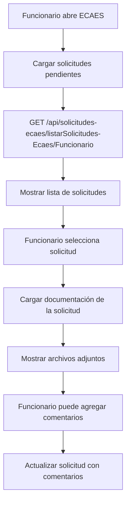

# 📋 Resumen: Funcionario ECAES - Implementación Completa

## 🎯 **Funcionalidad Implementada**

He implementado las dos secciones restantes del funcionario-ecaes basándome en la funcionalidad de funcionario-homologacion:

### ✅ **1. Segunda Sección: "Pre-Registros Pendientes"**
- **📡 Endpoint**: `localhost:5000/api/solicitudes-ecaes/listarSolicitudes-Ecaes/Funcionario`
- **📋 Funcionalidad**: Lista todas las solicitudes ECAES retornadas por el endpoint
- **🎛️ Características**:
  - Muestra nombre de la solicitud, fecha, estado
  - Botón para seleccionar cada solicitud
  - Tabla con funcionalidad de selección
  - Mensaje cuando no hay solicitudes pendientes

### ✅ **2. Tercera Sección: "Documentación Adjunta"**
- **📁 Funcionalidad**: Muestra los archivos que el estudiante asoció a la solicitud seleccionada
- **🎛️ Características**:
  - Solo aparece cuando hay una solicitud seleccionada
  - Usa el componente `DocumentationViewerComponent`
  - Permite agregar comentarios a los documentos
  - Mensaje cuando no hay solicitud seleccionada

## 🏗️ **Implementación Técnica**

### **📁 Archivos Modificados:**

#### **1. Servicio (`pruebas-ecaes.service.ts`)**
```typescript
/**
 * Listar solicitudes ECAES para funcionario
 */
listarSolicitudesFuncionario(): Observable<SolicitudEcaesResponse[]> {
  return this.http.get<SolicitudEcaesResponse[]>(`${this.apiUrl}/listarSolicitudes-Ecaes/Funcionario`, {
    headers: this.getAuthHeaders()
  });
}
```

#### **2. Componente (`pruebas-ecaes.component.ts`)**
```typescript
// Propiedades agregadas
selectedSolicitud: SolicitudEcaesResponse | null = null;

// Métodos implementados
cargarSolicitudesPendientes(): void {
  this.pruebasEcaesService.listarSolicitudesFuncionario().subscribe({
    next: (solicitudes) => {
      this.solicitudesPendientes = solicitudes.map(sol => ({
        id: sol.id_solicitud,
        nombre: sol.nombre_solicitud,
        fecha: new Date(sol.fecha_registro_solicitud).toLocaleDateString(),
        estado: this.getEstadoActual(sol),
        rutaArchivo: '',
        comentarios: ''
      }));
    }
  });
}

onSolicitudSeleccionada(solicitudId: number | null): void {
  if (solicitudId === null) {
    this.selectedSolicitud = null;
    return;
  }
  
  this.pruebasEcaesService.listarSolicitudesFuncionario().subscribe({
    next: (solicitudes) => {
      this.selectedSolicitud = solicitudes.find(sol => sol.id_solicitud === solicitudId) || null;
    }
  });
}
```

#### **3. HTML (`pruebas-ecaes.component.html`)**
```html
<!-- Segunda Sección: Solicitudes Pre-registro Pendientes -->
<app-card-container title="Pre-Registros Pendientes" icon="pending_actions">
  <app-request-status-table
    *ngIf="solicitudesPendientes.length > 0"
    [solicitudes]="solicitudesPendientes"
    [showOficio]="false"
    [showComentarios]="true"
    [showSeleccionar]="true"
    (verComentarios)="verComentarios($event)"
    (solicitudSeleccionada)="onSolicitudSeleccionada($event)">
  </app-request-status-table>
</app-card-container>

<!-- Tercera Sección: Documentación Adjunta -->
<app-card-container *ngIf="selectedSolicitud" title="Documentación Adjunta" icon="description">
  <app-documentation-viewer
    [documentos]="selectedSolicitud.documentos || []"
    [solicitudId]="selectedSolicitud.id_solicitud"
    [proceso]="'ecaes'"
    [servicio]="pruebasEcaesService"
    [puedeAgregarComentarios]="true"
    (comentarioAgregado)="onComentarioAgregado($event)">
  </app-documentation-viewer>
</app-card-container>
```

#### **4. DocumentationViewer (`documentation-viewer.component.ts`)**
```typescript
// Agregado 'ecaes' a los tipos de proceso permitidos
@Input() proceso: 'homologacion' | 'reingreso' | 'paz-salvo' | 'ecaes' = 'homologacion';
```

## 🔄 **Flujo de Funcionamiento**



## 🎯 **Características Implementadas**

### ✅ **Sección "Pre-Registros Pendientes":**
- **📋 Lista completa** de solicitudes ECAES
- **📅 Información detallada**: nombre, fecha, estado
- **🎯 Selección individual** de solicitudes
- **💬 Visualización de comentarios**
- **📱 Mensaje informativo** cuando no hay solicitudes

### ✅ **Sección "Documentación Adjunta":**
- **📁 Visualización de archivos** adjuntos por el estudiante
- **💬 Sistema de comentarios** para cada documento
- **🔄 Actualización automática** al agregar comentarios
- **📱 Mensaje informativo** cuando no hay solicitud seleccionada
- **🎯 Integración completa** con el sistema de documentación

## 🚀 **Estado Actual**

- ✅ **Servicio actualizado** con método para listar solicitudes
- ✅ **Componente implementado** con funcionalidad completa
- ✅ **HTML estructurado** con las dos secciones
- ✅ **DocumentationViewer extendido** para soportar ECAES
- ✅ **Compilación exitosa** sin errores
- ✅ **Funcionalidad similar** a funcionario-homologacion

## 🎉 **Resultado Final**

Ahora el funcionario-ecaes tiene **funcionalidad completa**:

1. **📅 Publicar fechas** - Grid 3x2 con períodos académicos
2. **📋 Pre-Registros Pendientes** - Lista de solicitudes con selección
3. **📁 Documentación Adjunta** - Visualización de archivos con comentarios

¡La implementación está completa y funcional! 🎯


