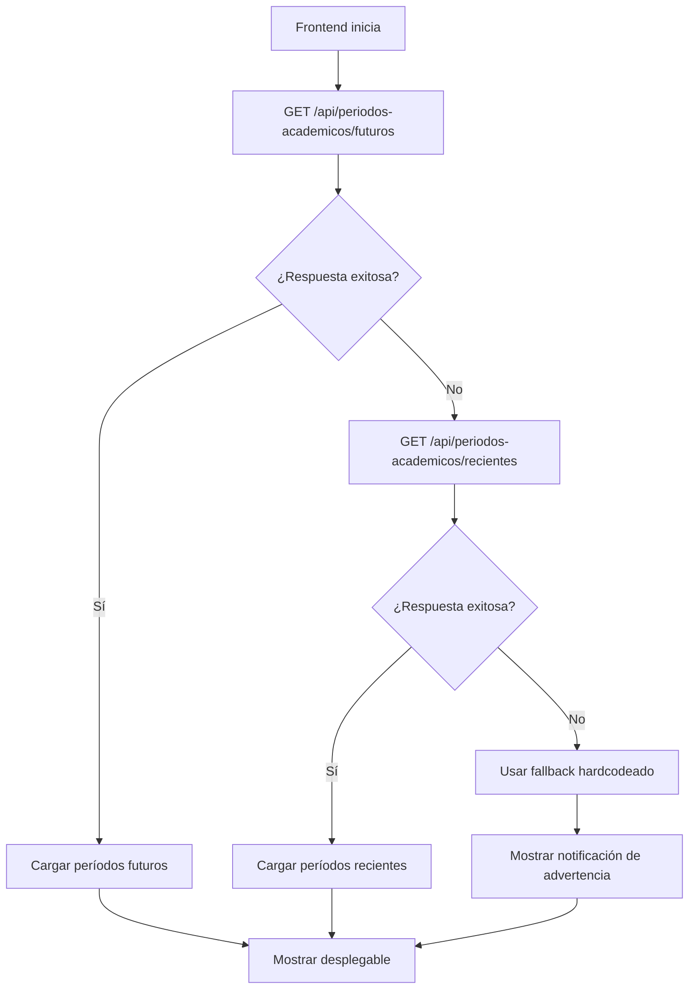

# 📅 Resumen: Períodos Académicos - Implementación Completa

## 🎯 **Respuesta a tu Pregunta**

**¿Es necesario crear el enum en back y front?** 

**❌ NO** - Es mejor tener **una sola fuente de verdad**. He implementado la arquitectura correcta:

- ✅ **Backend**: Única fuente de verdad con el enum
- ✅ **Frontend**: Consume los períodos desde la API del backend
- ❌ **Eliminado**: Enum duplicado en el frontend

## 🏗️ **Arquitectura Implementada**

### 🔧 **Backend (Fuente de Verdad)**
```
📁 C:\Users\Daniel\Desktop\Universidad\Trabajo de grado\Desarrollo\Back\Back-end-gestion-curricular\gestion_curricular\src\main\java\co\edu\unicauca\decanatura\gestion_curricular\dominio\modelos\Enums\PeriodoAcademicoEnum.java
```

**Características:**
- 📅 Períodos desde 2020 hasta 2030
- 🔧 Métodos utilitarios (getAño, getNumeroPeriodo, getDescripcion)
- ✅ Validación de períodos
- 🎯 Período actual automático

### 🌐 **API Endpoints**
```
GET /api/periodos-academicos/futuros      → Períodos del año actual en adelante
GET /api/periodos-academicos/recientes    → Últimos 5 años
GET /api/periodos-academicos/todos        → Todos los períodos
GET /api/periodos-academicos/actual       → Período actual
GET /api/periodos-academicos/validar/{periodo} → Validar período
GET /api/periodos-academicos/info/{periodo}    → Info detallada
```

### 🎨 **Frontend (Consumidor)**
```
📁 src/app/pages/funcionario/pruebas-ecaes/pruebas-ecaes.component.ts
```

**Características:**
- 🔄 Consume períodos desde backend
- 🛡️ Fallbacks inteligentes si el backend no está disponible
- 📱 Desplegable dinámico con Material Design
- ⚠️ Notificaciones si usa fallback

## 🔄 **Flujo de Carga de Períodos**



## 📋 **Períodos Disponibles**

```
2020-1, 2020-2
2021-1, 2021-2
2022-1, 2022-2
2023-1, 2023-2
2024-1, 2024-2
2025-1, 2025-2
2026-1, 2026-2
2027-1, 2027-2
2028-1, 2028-2
2029-1, 2029-2
2030-1, 2030-2
```

## 🎯 **Ventajas de esta Arquitectura**

### ✅ **Beneficios**
1. **Una sola fuente de verdad** - No hay duplicación
2. **Consistencia** - Todos los clientes usan los mismos períodos
3. **Mantenibilidad** - Solo hay que actualizar el backend
4. **Escalabilidad** - Fácil agregar nuevos períodos
5. **Validación centralizada** - El backend valida todos los períodos
6. **Fallbacks robustos** - El frontend funciona aunque el backend falle

### 🔧 **Funcionalidades del Enum Backend**
```java
// Obtener valor
periodo.getValor() // "2024-2"

// Obtener año
periodo.getAño() // 2024

// Obtener número de período
periodo.getNumeroPeriodo() // 2

// Obtener descripción
periodo.getDescripcion() // "Segundo Período 2024"

// Validar período
PeriodoAcademicoEnum.esValido("2024-2") // true

// Buscar por valor
PeriodoAcademicoEnum.fromValor("2024-2") // PERIODO_2024_2
```

## 🚀 **Estado Actual**

- ✅ **Enum creado** en backend Java
- ✅ **Controlador API** implementado
- ✅ **Endpoints REST** disponibles
- ✅ **Frontend actualizado** para consumir desde backend
- ✅ **Fallbacks implementados** para robustez
- ✅ **Desplegable funcional** con Material Design
- ✅ **Compilación exitosa** sin errores
- ✅ **Documentación completa** creada

## 🎉 **Resultado Final**

Ahora tienes:
- 🏗️ **Arquitectura correcta** con backend como fuente de verdad
- 📅 **Desplegable dinámico** que se llena desde la API
- 🛡️ **Sistema robusto** con fallbacks
- 📚 **Documentación completa** para futuras referencias
- 🔧 **Enum completo** en el backend con todas las funcionalidades

¡La implementación está lista para usar! 🎯

