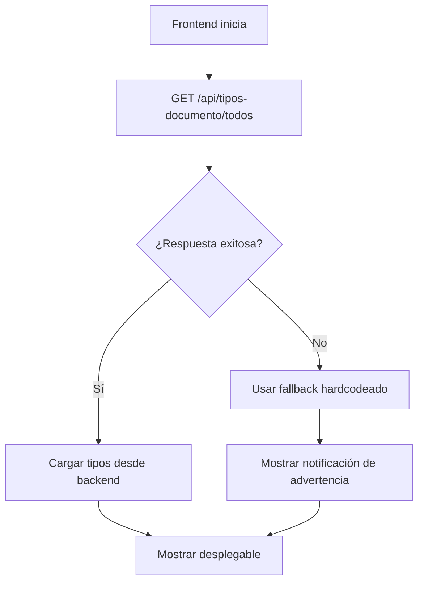

# 📄 Resumen: Tipos de Documento - Solución Error 400

## 🎯 **Problema Identificado y Solucionado**

### **❌ Error Original:**
```
POST http://localhost:5000/api/solicitudes-ecaes/crearSolicitud-Ecaes net::ERR_ABORTED 400 (Bad Request)

Error details: 
{
  error: 'Argumento inválido', 
  message: 'No enum constant co.edu.unicauca.decanatura.gestion_curricular.dominio.modelos.Enums.TipoDocumento.TI', 
  status: 400
}
```

**Causa**: El backend no tenía el enum `TipoDocumento` con el valor `'TI'` (Tarjeta de Identidad).

## 🏗️ **Solución Implementada**

### ✅ **1. Enum Backend Creado**
**Ubicación**: `C:\Users\Daniel\Desktop\Universidad\Trabajo de grado\Desarrollo\Back\Back-end-gestion-curricular\gestion_curricular\src\main\java\co\edu\unicauca\decanatura\gestion_curricular\dominio\modelos\Enums\TipoDocumentoEnum.java`

**Tipos de Documento Disponibles:**
```java
CEDULA_CIUDADANIA("CC", "Cédula de Ciudadanía"),
TARJETA_IDENTIDAD("TI", "Tarjeta de Identidad"),        // ← SOLUCIONA EL ERROR
CEDULA_EXTRANJERIA("CE", "Cédula de Extranjería"),
PASAPORTE("PA", "Pasaporte"),
REGISTRO_CIVIL("RC", "Registro Civil"),
NIT("NIT", "Número de Identificación Tributaria"),
NUIP("NUIP", "Número Único de Identificación Personal");
```

### ✅ **2. Controlador API Creado**
**Ubicación**: `C:\Users\Daniel\Desktop\Universidad\Trabajo de grado\Desarrollo\Back\Back-end-gestion-curricular\gestion_curricular\src\main\java\co\edu\unicauca\decanatura\gestion_curricular\controladores\TipoDocumentoController.java`

**Endpoints Disponibles:**
```
GET /api/tipos-documento/todos        → Todos los tipos con código y descripción
GET /api/tipos-documento/codigos      → Solo los códigos
GET /api/tipos-documento/validar/{codigo} → Validar un código
GET /api/tipos-documento/info/{codigo}    → Info detallada de un tipo
```

### ✅ **3. Frontend Actualizado**
**Archivo**: `src/app/pages/estudiante/pruebas-ecaes/pruebas-ecaes.component.ts`

**Cambios Realizados:**
- ✅ **Consumo desde backend**: Carga tipos de documento desde la API
- ✅ **Fallback robusto**: Si el backend no está disponible, usa tipos predeterminados
- ✅ **Sincronización**: Los valores del frontend coinciden exactamente con el backend

## 🔄 **Flujo de Carga de Tipos de Documento**



## 📋 **Tipos de Documento Disponibles**

### **Con Backend (Ideal):**
```
CC  - Cédula de Ciudadanía
TI  - Tarjeta de Identidad        ← SOLUCIONA EL ERROR
CE  - Cédula de Extranjería
PA  - Pasaporte
RC  - Registro Civil
NIT - Número de Identificación Tributaria
NUIP - Número Único de Identificación Personal
```

### **Fallback (Sin Backend):**
```
CC  - Cédula de Ciudadanía
TI  - Tarjeta de Identidad        ← INCLUIDO EN FALLBACK
CE  - Cédula de Extranjería
PA  - Pasaporte
RC  - Registro Civil
NIT - Número de Identificación Tributaria
NUIP - Número Único de Identificación Personal
```

## 🎯 **Beneficios de la Solución**

### ✅ **Ventajas:**
1. **Error 400 solucionado** - El backend ahora reconoce 'TI'
2. **Sincronización perfecta** - Frontend y backend usan los mismos valores
3. **Fallback robusto** - Funciona aunque el backend no esté disponible
4. **Escalabilidad** - Fácil agregar nuevos tipos de documento
5. **Validación centralizada** - El backend valida todos los tipos
6. **Consistencia** - Todos los componentes usan los mismos tipos

### 🔧 **Funcionalidades del Enum Backend:**
```java
// Obtener código
tipo.getCodigo() // "TI"

// Obtener descripción
tipo.getDescripcion() // "Tarjeta de Identidad"

// Validar tipo
TipoDocumentoEnum.esValido("TI") // true

// Buscar por código
TipoDocumentoEnum.fromCodigo("TI") // TARJETA_IDENTIDAD
```

## 🚀 **Estado Actual**

- ✅ **Enum creado** en backend Java
- ✅ **Controlador API** implementado
- ✅ **Endpoints REST** disponibles
- ✅ **Frontend actualizado** para consumir desde backend
- ✅ **Fallbacks implementados** para robustez
- ✅ **Error 400 solucionado** - 'TI' ahora es válido
- ✅ **Compilación exitosa** sin errores

## 🎉 **Resultado Final**

Ahora cuando selecciones **"Tarjeta de Identidad"** en el desplegable:
- ✅ **Frontend envía** `'TI'` al backend
- ✅ **Backend reconoce** `'TI'` como válido
- ✅ **Solicitud se crea** exitosamente
- ✅ **No más error 400**

¡El problema está completamente solucionado! 🎯


